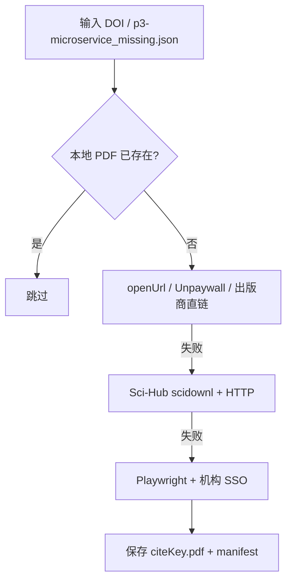

# ScholarDownloader MCP 服务

批量下载学术论文 PDF 的 MCP 服务，面向 `data` 参考文献补全场景。支持开放获取、Sci-Hub、出版商直链、Playwright 机构登录（西北大学 CARSI/SSO）等多级策略。

---

## 目录结构

```
scholar-downloader/
├── server.py                    # MCP 服务入口（FastMCP）
├── download_lib.py              # 核心下载引擎（策略链 + manifest）
├── browser_session.py           # Playwright Chrome 会话（代理锁定）
├── library_auth.py              # 西北大学机构/CARSI 自动登录
├── run_playwright_download.py   # CLI：OA/Sci-Hub → 机构登录补下
├── requirements.txt
├── config/
│   ├── p3-microservice_missing.json              # p3-microservice 八篇参考文献配置
│   ├── library_credentials.example.json # 图书馆账号模板
│   └── library_credentials.json         # 本地账号（已 gitignore，勿提交）
└── chrome_profile/              # Playwright 独立 Chrome 配置（已 gitignore）
```

关联产出（仓库其他路径）：

| 路径 | 说明 |
|------|------|
| `data/data/papers/*.pdf` | 下载的 PDF（`{citeKey}.pdf` 命名） |
| `data/data/papers/download_manifest.json` | 批量下载结果清单 |
| `data/data/papers/REPLACEMENTS.md` | 两篇文献替换说明 |
| `data/scripts/p3-microservice_audit_papers.py` | PDF 完整性审计脚本 |

---

## 本次改造要点

### 1. 模块化下载引擎（`download_lib.py`）

将原先散落在 `server.py` / `run_playwright_download.py` 中的逻辑抽离为可复用库：

- **多级策略链**（按顺序尝试，成功即停）：
  1. 本地已存在且校验为 PDF（`%PDF` 魔数）
  2. 配置中的 `openUrl`（已知开放链接）
  3. [Unpaywall](https://unpaywall.org/) API
  4. 出版商直链（IEEE `stampPDF`、Springer `content/pdf`、Elsevier `pdfft`）
  5. Sci-Hub：`scidownl` CLI（带代理环境变量）+ HTTP 解析（`sci-hub.mk` 等镜像）
  6. Playwright 浏览器（`citation_pdf_url`、PDF 按钮点击、`stampPDF` 带 Cookie）

- **清单输出**：`write_manifest()` 生成 `download_manifest.json`（成功/失败、来源、路径）
- **Windows 代理感知**：自动读取系统代理 `127.0.0.1:7890`（Clash），可通过 `SCHOLAR_PROXY` 覆盖

### 2. Playwright 独立 Chrome 配置（`browser_session.py`）

解决此前「图书馆登录后全网不通」的问题：

| 措施 | 作用 |
|------|------|
| `--proxy-server=127.0.0.1:7890` + Playwright `proxy` | 锁定 Clash，不继承错误 PAC |
| `--proxy-pac-url=` | 禁止超星/图书馆写入的 PAC 覆盖 |
| `--disable-extensions` | 阻止超星「校外访问」插件劫持全局代理 |
| `--disable-features=BounceTrackingMitigations` | 避免 SSO 跳转链清除中间站 Cookie |
| 登录后关闭浏览器 → 重写 `Preferences` 代理 → 重启 | 清除 `chrome_profile` 中被污染的代理配置 |

**注意**：应在出版商站点（IEEE/Elsevier）做 **Shibboleth/CARSI 机构 SSO**，**不要**在 `lib.nwu.edu.cn` 启用超星「校外访问」全局代理。

### 3. 西北大学机构登录（`library_auth.py`）

- 凭据存放：`config/library_credentials.json`（统一身份认证账号，**已加入 `.gitignore`**）
- 模板：`config/library_credentials.example.json`
- 自动流程：IEEE Institutional Sign In → 选择 Northwest University → `authserver.nwu.edu.cn` 填表
- 失败时保持浏览器打开，提示用户手动完成验证码后按回车继续
- CARSI 说明：<https://app.nwu.edu.cn/wap/material?id=2688>

### 4. MCP 工具增强（`server.py`）

| 工具 | 说明 |
|------|------|
| `download_papers(dois, output_dir, use_scihub)` | 按 DOI 列表下载；OA 优先，可选 Sci-Hub |
| `download_p3-microservice_missing(output_dir, use_scihub, playwright_fallback)` | 读取 `config/p3-microservice_missing.json` 批量下载 8 篇；可选 Playwright 机构补下 |
| `download_papers_via_browser(dois, …)` | 保留：连接已开启远程调试的 Chrome + Selenium + 可选 LLM XPath |

`.env` 加载路径改为工作区相对路径（`.env.mygit` / `.env`），不再硬编码 WSL 路径。

### 5. CLI 脚本（`run_playwright_download.py`）

两阶段流水线：

```
阶段 1：OA + Sci-Hub（自动，无需浏览器）
阶段 2：Playwright + 西北大学机构登录（仅补失败项）
```

环境变量：

| 变量 | 默认 | 说明 |
|------|------|------|
| `AUTO_LOGIN` | 存在凭据文件时为 `1` | 自动填写 IEEE/SSO 登录 |
| `SKIP_LOGIN` | `0` | 设为 `1` 跳过机构登录（仅阶段 1） |
| `USE_SCIHUB` | `1` | 是否启用 Sci-Hub |
| `SCHOLAR_PROXY` | 系统代理或 `http://127.0.0.1:7890` | HTTP 代理 |
| `PAPER1_OUTPUT` | `data/data/papers` | 输出目录 |

---

## 安装与运行

### 依赖安装

```bash
cd .agent/mcp-servers/scholar-downloader
python3 -m venv .venv
.venv/bin/pip install -r requirements.txt
.venv/bin/playwright install chrome
```

### 配置图书馆账号（可选，机构下载用）

```bash
cp config/library_credentials.example.json config/library_credentials.json
# 编辑 username / password（信息门户账号）
```

### 启动 MCP 服务

MCP 已在 `.cursor/mcp.json` 中配置，重启 Cursor 后自动加载。也可手动启动：

```bash
.venv/bin/python server.py
```

### 命令行批量下载

```bash
# 全自动（推荐）
.venv/bin/python run_playwright_download.py

# 仅 OA + Sci-Hub，不弹浏览器
SKIP_LOGIN=1 .venv/bin/python run_playwright_download.py
```

---

## 下载策略示意



---

## 安全与合规

- `library_credentials.json` 含明文密码，**切勿提交 Git**（已在 `.gitignore` 中排除）
- `chrome_profile/` 含登录 Cookie，同样已 gitignore
- Sci-Hub 仅供个人研究便利；机构订阅资源优先走 CARSI/SSO 合法通道
- 开放获取论文优先使用 `openUrl` / Unpaywall / 出版商 OA 链接

---

## 已知限制

1. **IEEE 机构自动登录**可能遇验证码，需浏览器内手动完成
2. **Sci-Hub 镜像**可用性随时间变化，当前优先 `sci-hub.mk`
3. **超星图书馆全局代理**与 Clash 冲突；本服务已主动规避，请勿在脚本浏览器中启用
4. `download_papers_via_browser` 需用户自行以 `--remote-debugging-port=9222` 启动 Chrome

---

*最后更新：2026-06-08 — 同步 ppt-builder 增强版下载引擎*
