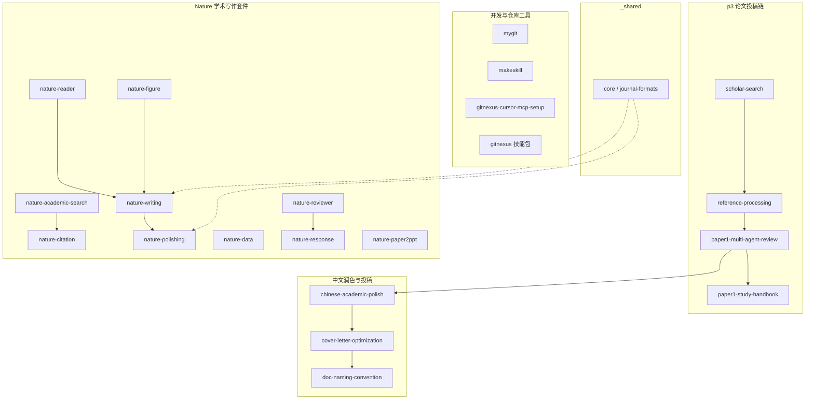

# 项目 Agent 技能

本目录是 **p3-microservice** 仓库的 Agent 技能**源目录**（20 个手写技能 + 1 个 GitNexus 技能包链接 + 1 个共享资源目录）。Cursor 通过 `.cursor/skills/` 符号链接镜像本目录，实现自动发现与按需触发。

**最后更新**：2026-06-12

---

## 目录布局

| 路径 | 作用 |
|------|------|
| **`.agent/skills/<name>/`** | 技能**源目录**（`SKILL.md`、脚本、参考文档） |
| **`.cursor/skills/<name>/`** | Cursor **发现入口**（符号链接 → `.agent/skills/`） |
| **`.agent/skills/_shared/`** | nature 系列**共享片段**（非技能，无 `SKILL.md`） |
| **`.agent/skills/gitnexus/`** | → **符号链接** → `.claude/skills/gitnexus/`（`gitnexus analyze` 写入的权威目录） |

### 镜像同步

```bash
bash scripts/link_cursor_skills.sh   # 清空 .cursor/skills/ 并逐项链接
```

新增或删除技能后执行上述命令，然后**重启 Cursor** 或新开 Agent 会话。

**GitNexus 技能包**由 `npx gitnexus analyze` 写入 `.claude/skills/gitnexus/`；`.agent/skills/gitnexus` 与 `.cursor/skills/gitnexus` 均通过符号链接指向该目录，三者内容始终一致。重新 analyze 后无需再跑链接脚本（除非增删了 `.agent/skills/` 顶层项）。

### 是否自动加载？

| 位置 | Cursor 自动发现 | 自动触发 |
|------|-----------------|----------|
| `.agent/skills/`  alone | ❌ | ❌ |
| `.cursor/skills/`（链接后） | ✅ | ✅（依 `description` 匹配） |
| `.claude/skills/gitnexus/`（权威源） | ✅ | ✅ |
| `.agent/skills/gitnexus/`（链接） | ✅（经 `.cursor/skills/`） | ✅ |

---

## 技能分类总览



| 分类 | 技能数 | 定位 |
|------|--------|------|
| **p3 论文投稿** | 4 | 面向本仓库中文 LaTeX 稿件、实验数据、JOS 投稿门禁 |
| **中文润色与投稿** | 3 | 中文论文润色、投稿信撰写优化、文档版本化命名 |
| **Nature 学术套件** | 10 | 通用高水平英文稿：检索、写作、润色、配图、审稿回复等 |
| **开发工具** | 3 | Git 提交、技能脚手架、GitNexus MCP 安装 |
| **共享资源** | 1 目录 | `_shared/`：多技能复用的定义与规范片段 |

---

## 技能速查表

| 技能 | 一句话 | 典型触发词 |
|------|--------|------------|
| [scholar-search](scholar-search/SKILL.md) | 文献搜索、下载 PDF、生成 BibTeX、C6 引用核实 | 文献搜索、下载 PDF、references.bib |
| [reference-processing](reference-processing/SKILL.md) | 参考文献扩展与投稿门禁编排（编排 scholar-search + verify） | 扩充参考文献、C6 核验、文献归档 |
| [paper1-multi-agent-review](paper1-multi-agent-review/SKILL.md) | p3 稿件多角色模拟审稿（Phase 0–5） | 论文审核、软件学报投稿前审核、多角色评审 |
| [paper1-study-handbook](paper1-study-handbook/SKILL.md) | 从 L0/L1 真相源同步 `docs/study/` 学习手册 | 学习手册、study 同步 |
| [nature-academic-search](nature-academic-search/SKILL.md) | 多源文献检索与引文管理（MCP：PubMed/CrossRef 等） | 文献检索、查文献、引文核对 |
| [nature-citation](nature-citation/SKILL.md) | 为段落自动补 Nature/CNS 旗舰期刊引用 | 分段引用、自动给出引用 |
| [nature-writing](nature-writing/SKILL.md) | 从零起草/重构 Nature 风格章节 | 写论文、起草引言/摘要、搭框架 |
| [nature-polishing](nature-polishing/SKILL.md) | 润色已有文稿为出版级英文；含 LaTeX 排版修复 | 论文润色、英文润色、排版 |
| [nature-reader](nature-reader/SKILL.md) | 全文中英对照 Markdown 精读（保留图表锚点） | 读论文、论文翻译、精读 |
| [nature-figure](nature-figure/SKILL.md) | Python/R 期刊级科研配图（matplotlib/ggplot2） | 论文配图、科研绘图、出图 |
| [nature-data](nature-data/SKILL.md) | Data Availability 声明与 FAIR 元数据清单 | 数据可用性、repository、FAIR |
| [nature-reviewer](nature-reviewer/SKILL.md) | 审稿人视角预审（3 份报告 + 综合） | 预审稿、审稿人视角 |
| [nature-response](nature-response/SKILL.md) | 逐点回复审稿意见 / 修回信 | 审稿意见回复、大修回复 |
| [nature-paper2ppt](nature-paper2ppt/SKILL.md) | 论文 → 中文组会 PPTX（含自检修订环） | 论文做 PPT、组会汇报 |
| [mygit](mygit/SKILL.md) | AI 生成中文 Conventional Commits 并 push | git commit、提交代码、mygit.sh |
| [makeskill](makeskill/SKILL.md) | 新建符合规范的项目技能脚手架 | 新建技能、创建 Skill |
| [gitnexus-cursor-mcp-setup](gitnexus-cursor-mcp-setup/SKILL.md) | Linux/WSL 安装配置 GitNexus MCP | GitNexus MCP、代码智能 |
| [gitnexus/](gitnexus/gitnexus-guide/SKILL.md) | 代码智能技能包（6 个子技能，链至 `.claude/skills/gitnexus/`） | gitnexus_impact、代码探索、重构 |
| [chinese-academic-polish](chinese-academic-polish/SKILL.md) | 中文学术论文润色：去 AI 味、短句化、去模板 | 中文润色、去AI味、改大白话 |
| [cover-letter-optimization](cover-letter-optimization/SKILL.md) | 投稿信撰写与优化（五段式、一页 A4、版本化输出） | 投稿信、cover letter、润色投稿信 |
| [doc-naming-convention](doc-naming-convention/SKILL.md) | 文档版本化命名（方案、投稿附件、论文稿件） | 文档命名、版本号、投稿附件命名 |

---

## 按任务选技能

| 你想做的事 | 推荐技能 | 备注 |
|------------|----------|------|
| 按主题搜文献、下 PDF | `scholar-search` | OpenAlex 免费；p3 专用脚本 |
| 扩参考文献、跑 C6 门禁、写归档报告 | `reference-processing` | 编排全流程；必读 scholar-search |
| 投稿前多角色审稿、对照基准论文 | `paper1-multi-agent-review` | 输出 `reviews/{run_id}/` |
| 更新答辩/入门学习手册 | `paper1-study-handbook` | 同步 `docs/study/` |
| 搜 Nature/CNS 文献、转 .bib | `nature-academic-search` | 需 MCP；多步工作流 |
| 给段落补 CNS 引用 | `nature-citation` | 限 Nature/Science/Cell 系 |
| 从零写英文稿某章节 | `nature-writing` | Router + `manifest.yaml` |
| 润色已有英文段 / 修 LaTeX 排版 | `nature-polishing` | 含 `references/latex-layout.md` |
| 精读一篇外文论文 | `nature-reader` | 中英对照，非摘要式 |
| 画投稿级多 panel 图 | `nature-figure` | 先问 Python 还是 R |
| 写 Data Availability | `nature-data` | FAIR 清单 |
| 投稿前模拟审稿人 | `nature-reviewer` | 与 `nature-response` 互补 |
| 写逐点回复信 | `nature-response` | 大修/小修 |
| 论文做组会 PPT | `nature-paper2ppt` | 输出 `.pptx` |
| 智能 git commit + push | `mygit` | 需 `.env.mygit` |
| 新建项目技能 | `makeskill` | 完成后跑 `link_cursor_skills.sh` |
| 配置代码智能 MCP | `gitnexus-cursor-mcp-setup` | 配合 `.claude/skills/gitnexus/` |
| 中文论文润色 / 去 AI 味 | `chinese-academic-polish` | 短句化、去模板、保学术 |
| 写 / 优化投稿信 | `cover-letter-optimization` | 五段式、一页 A4、版本化 |
| 文档输出到 docs/ 时统一命名 | `doc-naming-convention` | 版本号 + 时间戳 |

---

## p3 论文投稿链（详细）

面向本仓库**分布式定向日志采集**中文稿件（`latex/main-jos.tex`、`latex/main-zh.tex`）。

### 1. scholar-search

- **目标**：调研扩展文献；核实正文 `\cite{}` 并归档至 `data/papers/`
- **关键脚本**：`scripts/scholar_search.py`、`scripts/download_papers.py`
- **配置**：[config.md](scholar-search/config.md)、[实战技巧.md](scholar-search/实战技巧.md)
- **输出**：BibTeX、JSON、`data/papers/cited_papers_manifest.json`
- **门禁配合**：`python3 scripts/verify_cited_papers.py --download`（exit 0）

### 2. reference-processing

- **目标**：把「文献不足 / 不可核 / 未归档」处理成可投稿闭环
- **编排对象**：`scholar-search` → `latex/references.bib` → 正文 `\cite{}` → `verify_cited_papers.py` → `docs/*报告*.md` → 版本化 PDF
- **原则**：只统计正文真实引用；禁止 `\nocite{}` 堆数；中文期刊优先官网/CHNDOI
- **报告落盘**：`docs/YYYYMMDD-HHMMSS-*.md`

### 3. paper1-multi-agent-review

- **目标**：模拟多角色同行评审（预检 → 盲审 → 交叉质询 → PI 裁决 → 综合报告）
- **配置入口**：[config.md](paper1-multi-agent-review/config.md)（`TARGET_JOURNAL=JOS` 默认）
- **必读文档**：审核细则、软件学报投稿要点、参考文献归档细则、顶级期刊规范指南
- **输出**：`reviews/{run_id}/` 下 12 个文件（Phase 0–5）
- **Phase 1 门禁**：运行 `verify_cited_papers.py`（C6）
- **默认行为**：只出报告，不直接改 `.tex`（改稿见改稿衔接.md）

### 4. paper1-study-handbook

- **目标**：以 L0 机器结果 + L1 人类报告为唯一真相源，维护 `docs/study/` 学习手册
- **数据分层**：L0（`experiments/results/`）→ L1（`docs/` 报告）→ L2（`docs/study/` 叙事）
- **优先更新**：README、论文全景、实验数据、导师拷问速答
- **禁止**：在学习手册中维护第二套实验数字

### p3 推荐工作流

```text
实验完成 → scholar-search（调研）
         → reference-processing（扩引文 + C6 门禁 + 编译版本化 PDF）
         → paper1-multi-agent-review（投稿前审核）
         → 按评审改稿 → 再跑 reference-processing + 二评
         → chinese-academic-polish（中文润色）
         → cover-letter-optimization（撰写/优化投稿信）
         → doc-naming-convention（版本化输出到 docs/）
         → paper1-study-handbook（同步学习手册）
```

---

## Nature 学术写作套件（详细）

10 个技能采用 **Router 架构**：`SKILL.md`（路由）+ `manifest.yaml`（轴检测）+ `static/`（可版本化片段）+ `references/`（深度参考）。执行时**必须从磁盘加载片段**，不可凭记忆套用。

### 套件内关系

| 阶段 | 技能 | 说明 |
|------|------|------|
| 检索 | `nature-academic-search` | MCP 多源检索、MeSH 策略、.bib/.ris 转换 |
| 引用 | `nature-citation` | 段落级自动补 CNS 旗舰刊引用 |
| 阅读 | `nature-reader` | PDF/DOI → 中英对照 Markdown |
| 起草 | `nature-writing` | 按 paper_type × section × journal 路由起草 |
| 润色 | `nature-polishing` | 短语库 + Nature 范文模式 + LaTeX 排版 |
| 配图 | `nature-figure` | matplotlib / ggplot2 投稿级出图 |
| 数据 | `nature-data` | Data Availability、repository、FAIR |
| 预审 | `nature-reviewer` | 审稿人视角 3+1 报告 |
| 回复 | `nature-response` | 逐点修回信 |
| 汇报 | `nature-paper2ppt` | 论文 → 中文 PPTX |

### 与 p3 技能的区别

| 维度 | p3 链（scholar-search 等） | nature 套件 |
|------|---------------------------|-------------|
| 稿件 | 本仓库中文 LaTeX | 通用英文/Nature 风格 |
| 文献源 | OpenAlex/SerpApi + 中文期刊官网 | MCP（PubMed/CrossRef 等）+ CNS 过滤 |
| 输出 | `data/papers/`、`reviews/`、`docs/study/` | 文稿片段、图、PPT、审稿回复 |
| 投稿目标 | 《软件学报》/《计算机学报》 | Nature 家族 / 高影响因子英文刊 |

> **注意**：扩写 p3 中文稿参考文献时优先用 `reference-processing`；写英文 Nature 稿或做 CNS 引用时用 nature 套件。

### `_shared/` 共享层

非技能目录，供多个 nature 技能通过 `manifest.yaml` 的 `always_load` 引用：

| 文件 | 用途 | 使用方 |
|------|------|--------|
| `core/reader-workflow.md` | 读者工作流 | polishing, writing |
| `core/paper-type-taxonomy.md` | 论文类型分类 | polishing, writing |
| `core/ethics.md` | 伦理与边界 | polishing, writing |
| `core/terminology-ledger.md` | 术语表 | polishing, writing |
| `journal-formats/nat-comms.md` | Nature Communications 体例 | polishing, writing |

**原则**：≥2 个技能共用的**定义层**放 `_shared/`；各技能的**动作层**（如何诊断、起草、修订）保留在各自 `static/fragments/`。

---

## 开发工具（详细）

### mygit

- **命令**：`./scripts/mygit.sh` 或 `bun run mygit`
- **依赖**：`.env.mygit`（DashScope API）
- **流程**：检测变更 → AI 生成中文 Conventional Commits → add → commit → push

### makeskill

- **用途**：在 `.agent/skills/<name>/` 生成标准目录与 `SKILL.md` 模板
- **完成后**：`bash scripts/link_cursor_skills.sh`

### gitnexus-cursor-mcp-setup

- **用途**：WSL/Linux 配置 `~/.cursor/mcp.json` 启用 GitNexus MCP
- **配合**：`gitnexus/` 技能包（见下）

### gitnexus（技能包，符号链接）

- **权威目录**：`.claude/skills/gitnexus/`（`npx gitnexus analyze` 生成/更新）
- **镜像链接**：`.agent/skills/gitnexus` → `.cursor/skills/gitnexus` → 同上
- **子技能**（各含 `SKILL.md`）：

| 子技能 | 用途 |
|--------|------|
| `gitnexus-exploring` | 架构探索、执行流追踪 |
| `gitnexus-impact-analysis` | 改代码前影响面分析 |
| `gitnexus-debugging` | 错误溯源与调试 |
| `gitnexus-refactoring` | 安全重命名/提取/拆分 |
| `gitnexus-guide` | MCP 工具与图谱 schema 参考 |
| `gitnexus-cli` | analyze / status / clean / wiki CLI |

- **约定**：改函数/类前跑 `gitnexus_impact`；探索用 `gitnexus_query` / `gitnexus_context`；提交前 `gitnexus_detect_changes`

---

## 新建技能

1. 用 `makeskill` 或手动在 `.agent/skills/<name>/` 创建 `SKILL.md`
2. `description` 写清 **做什么 + 何时用**（第三人称，含中英文触发词）
3. 勿加 `disable-model-invocation: true`（除非仅 `@` 手动触发）
4. 运行 `bash scripts/link_cursor_skills.sh`
5. 若需 Agent 自动匹配，同步更新 `.cursor/rules/project-skills.mdc` 索引表

---

## Skills 与 Rules 的区别

| 类型 | 位置 | 作用 |
|------|------|------|
| **Skills**（本目录） | `.agent/skills/` | 完整工作流；Agent 按需读取 `SKILL.md` 执行 |
| **Rules** | `.cursor/rules/*.mdc` | 短约束与索引；如 `project-skills.mdc`、`scholar-cited-checklist.mdc` |

Rules 指向 Skills，但不替代 Skills 内的详细步骤与脚本说明。

---

## 完整技能清单（按目录名）

| # | 目录 | 分类 | SKILL.md |
|---|------|------|----------|
| 1 | `scholar-search` | p3 | ✅ |
| 2 | `reference-processing` | p3 | ✅ |
| 3 | `paper1-multi-agent-review` | p3 | ✅ |
| 4 | `paper1-study-handbook` | p3 | ✅ |
| 5 | `chinese-academic-polish` | 润色 | ✅ |
| 6 | `cover-letter-optimization` | 润色 | ✅ |
| 7 | `doc-naming-convention` | 润色 | ✅ |
| 8 | `nature-academic-search` | nature | ✅ |
| 9 | `nature-citation` | nature | ✅ |
| 10 | `nature-writing` | nature | ✅ |
| 11 | `nature-polishing` | nature | ✅ |
| 12 | `nature-reader` | nature | ✅ |
| 13 | `nature-figure` | nature | ✅ |
| 14 | `nature-data` | nature | ✅ |
| 15 | `nature-reviewer` | nature | ✅ |
| 16 | `nature-response` | nature | ✅ |
| 17 | `nature-paper2ppt` | nature | ✅ |
| 18 | `mygit` | dev | ✅ |
| 19 | `makeskill` | dev | ✅ |
| 20 | `gitnexus-cursor-mcp-setup` | dev | ✅ |
| 21 | `gitnexus` | dev（链接包） | ✅（6 个子技能，源在 `.claude/skills/gitnexus/`） |
| — | `_shared` | 共享 | ❌（非技能） |
