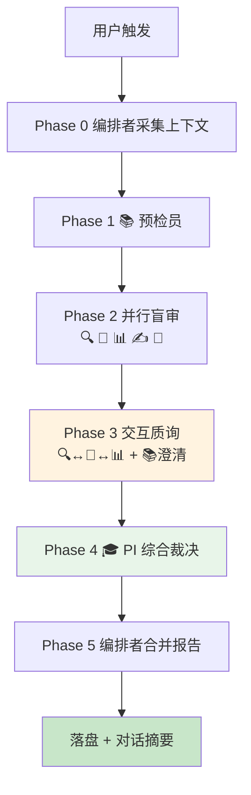

# Paper I 多智能体交互式审核 — Cursor 执行方案

> **版本**: v2.0（由 v1.0「Paper Forge 工程实现」调整为 **Cursor AI 直接执行**）  
> **日期**: 2026-06-03  
> **状态**: 可执行工作手册  
> **执行者**: **Cursor 对话中的 AI 助手**（下文称「执行 Agent」）— 由执行 Agent **依次扮演**各审稿角色，完成全流程并写入评审文件  
> **技能包目录**: `.cursor/skills/paper1-multi-agent-review/`（本文件与 [SKILL.md](SKILL.md) 同目录，可整体复制）  
> **路径配置**: [config.md](config.md)（`PAPER1_ROOT`，默认 `doctor/paper1`）  
> **角色定义**: [角色定义手册.md](角色定义手册.md)  
> **预检种子**: [已知问题清单.md](已知问题清单.md)（C1–N4）  
> **领域上下文**: [论文领域要点.md](论文领域要点.md)

---

## 1. 方案定位（必读）

### 1.1 与 v1.0 的差异

| 维度 | v1.0（已废弃为主路径） | v2.0（本文档） |
|------|------------------------|----------------|
| 执行主体 | Paper Forge / `pp-*` / API / SSE | **当前 Cursor 会话中的 AI** |
| 实现要求 | 需开发 `paper-forge` 模块、数据库、前端 | **无需开发**；读仓库 → 扮演角色 → 写 Markdown |
| 触发方式 | `POST /api/paper-forge/projects/:id/review` | 用户对 Cursor 说：**「执行 Paper I 多角色审核」**（或等价指令） |
| 产出位置 | `{PAPER1_ROOT}/reviews/{run_id}/` | **相同**（见 config.md） |

### 1.2 执行 Agent 的承诺

当用户触发本流程时，执行 Agent **必须**：

1. **亲自完成** Phase 0→5，不得仅输出「建议你去跑某脚本」而停步（除非环境缺少只读所必需的文件）。  
2. **分角色产出**：每个角色单独一节或单独文件，标题标明角色（🎓📚📊✍️🔍🔬📐）。  
3. **证据锚定**：Major 问题须带 `tex` 路径、行号区间或 `experiments/results/*.json` 字段。  
4. **数值以仓库为准**：用 `Read`/`Grep`/`Shell` 核对 CSV/JSON，**禁止**凭记忆编造 M1/M2/τ。  
5. **落盘交付**：在 `{PAPER1_ROOT}/reviews/{run_id}/` 写入完整报告（路径见 [config.md](config.md)）；并在对话中给出 **执行摘要 + 指向主报告路径**。

### 1.3 不做的事

- ❌ 不在本流程中直接改 `.tex`（修改属「迭代完善」任务，需用户另下指令）。  
- ❌ 不依赖 Paper Forge 服务是否在线。  
- ❌ 不把「模拟审稿」说成已完成的真实同行评审。

---

## 2. 如何触发

用户可使用以下任一表述（执行 Agent 应识别并启动全流程）：

- 「执行 Paper I 多角色审核」
- 「按交互式审核设计方案审一遍 doctor/paper1」
- 「模拟审稿人 + PI 给 Paper I 全面评审建议」

**可选参数**（用户未说明时用默认值）：

| 参数 | 默认 | 说明 |
|------|------|------|
| 主审语言 | `en` | 盲审以 `latex/sections/*.tex` 英文稿为主 |
| 是否核对中文 | `yes` | 抽查 `sections/zh/` 与表格数字一致 |
| 审核轮次 | `1` | 首轮完整流程；用户要求时可再做 Round 2 |
| 输出目录 | 自动 | `reviews/{YYYYMMDD}-{HHmmss}/` |

---

## 3. 总体流程



**执行顺序约束**：

- Phase 2 各盲审角色：**先写完、互不可见**（执行 Agent 在内部依次扮演，输出时不得让审稿人 B 复述审稿人 A 的分数）。  
- Phase 3：**读完** Phase 2 全部报告后再写，专门处理分歧。  
- Phase 4：PI **可读**所有前置产物。

**角色隔离协议（Phase 2 必读）**：

同一个 Agent 依次扮演多角色时，须遵守以下纪律以缓解认知泄露风险：

1. **角色切换声明**：在每个角色的输出文件开头写明 `[角色切换] 以下以 {角色名} 身份独立审稿，不参考其他角色的结论`。  
2. **评分独立性**：禁止在后续角色输出中出现「与审稿人 A 一致」或「审稿人 A 已指出」等表述。  
3. **角色退出声明**：每个角色输出完成后，在文件末尾写明 `[角色退出] {角色名} 审稿完成`。  
4. **关注点隔离**：各角色只评价其职责范围内的维度（参见 6 角色扮演规范），不越界给出超出其视角的判断。  
5. **可选 - 随机化顺序**：若用户指定 `随机化=true`，Phase 2 角色顺序可打乱（默认顺序为 🔍→🔬→📊→✍️→📐）。

---

## 4. 输出目录与文件清单

每次运行创建：

```
{PAPER1_ROOT}/reviews/{run_id}/
├── 00-上下文清单.md              # Phase 0
├── 01-预检报告.md                # Phase 1 📚
├── 02-审稿人A-方法论.md          # Phase 2 🔍
├── 02-审稿人B-领域.md            # Phase 2 🔬
├── 02-统计审查.md                # Phase 2 📊
├── 02-编辑审查.md                # Phase 2 ✍️
├── 02-伦理审查.md                # Phase 2 📐
├── 03-交互质询纪要.md            # Phase 3
├── 04-PI综合裁决.md              # Phase 4 🎓
├── 05-全面评审报告.md            # Phase 5 主交付物 ★
├── 行动清单.md                   # P0/P1/P2 可勾选
└── 执行摘要.md                   # 给导师的一页纸
```

`{run_id}` 格式：`YYYYMMDD-HHmmss`（如 `20260603-173000`）。

---

## 5. 分阶段执行细则

### Phase 0 — 🎯 编排者：采集上下文

**目的**：建立本次审核的「证据底座」，避免漏审章节。

**执行 Agent 操作清单**：

```text
[ ] 读取 latex/main.tex，列出全部 \input{sections/...}
[ ] 统计 sections/*.tex 行数，标记 >150 行的章节
[ ] 列出 experiments/results/*.json 与 table_ii*.json
[ ] 若存在 submission/**/cover_letter.md，记录路径
[ ] 记录 git rev（可选）: git -C {PAPER1_ROOT} rev-parse --short HEAD
[ ] 写入 00-上下文清单.md
```

**`00-上下文清单.md` 必备表**：

| 章节文件 | 大致行数 | 审核优先级 |
|----------|----------|------------|
| `05_5_discussion.tex` | … | 高（已知 C2/C5） |
| … | … | … |

---

### Phase 1 — 📚 博士生：自动化预检

**扮演要点**：第一作者视角，**客观**罗列可验证问题，不辩护。

**必须执行的检查**：

| 检查项 | 工具/方法 | 对应已知 ID |
|--------|-----------|-------------|
| Abstract 中 M1/M2/τ 数值 | `Grep` abstract + `Read` `table_ii.json` | C3 |
| Cover Letter 数值 | `Grep` submission | C3 |
| `main.tex` 实验 `\input` 数量 | 数 `\input{sections/05` | C1 |
| Discussion 中 `\paragraph` 数量 | `Grep` `05_5_discussion.tex` | C2 |
| 「Reviewer FAQ」等非学术表述 | `Grep` -i faq | C5 |
| `references.bib` 缺 DOI | `Grep` 条目 | C4 |
| 断裂引用 | `Grep` `\\ref{` + 查 label（尽力） | — |
| 中英表格数字 | 对比 `table_ii.tex` vs `zh/table_ii.tex` | — |

**输出**：`01-预检报告.md`  
**结构**：`## 确认的问题` / `## 待作者确认` / `## 预检通过项`  
每条：`ID | 严重性 | 文件:行 | 描述 | 证据`

---

### Phase 2 — 并行盲审（5 个角色）

执行 Agent **按下列顺序依次扮演**，每角色完成后保存对应 `02-*.md`，**撰写下一角色前不复制上一角色的评分表**。

#### 2.1 🔍 审稿人 A（方法论 / 机器人与边缘计算）

**阅读范围**：`03_system`–`04_*`、`05_7`–`05_9`、`edge_iqa/`、`langgraph_router/` README（若存在）、`experiments/results/routing_benchmark.json` 等。

**必答问题**：

1. Edge-IQA 是否可复现？特征与 τ 标定是否写清？  
2. LangGraph 相对 FSM/Python 的增量是否证据充分？  
3. B0–B3 对比是否公平、同条件？  
4. M1（RTT）测量点、统计口径是否与 JSON 一致？  
5. 实时性声称（边侧 <30ms）与论文叙述是否一致？

**输出模板**（写入 `02-审稿人A-方法论.md`）：

```markdown
[角色切换] 以下以 审稿人A（方法论）身份独立审稿，不参考其他角色的结论

## 总体决定
accept | minor_revision | major_revision | reject

## 评分（1-10）
| 维度 | 分数 |
|------|------|
| technicalNovelty | |
| experimentalRigor | |
| reproducibility | |
| clarity | |
| **overall** | |

## Major Issues
### METHOD-M1: 标题
- **位置**: `sections/xx.tex` Laa-Lbb
- **证据**: `experiments/results/....json` 字段 ...
- **问题**: ...
- **建议**: ...
- **修改 sketch**: (给出 diff 方向或改写示例)
- **验收标准**: (可自动化验证的 grep/count/编译命令)
- **需同步文件**: (修改此处后需同步检查的其他文件)

## Minor Issues
（格式同 Major，但可省略修改 sketch）

## 优点
- ...

## 向作者提问
- ...

[角色退出] 审稿人A（方法论）审稿完成
```

#### 2.2 🔬 审稿人 B（领域 / 中医舌诊与医学影像）

**阅读范围**：`00_abstract`、`01_intro`、`02_related`、`05_4_*`、`05_2`、`06_conclusion`。

**必答问题**：

1. 临床价值与机器人采集结合是否说服人？  
2. ShezhenV3 / 合成退化 / 跨集验证是否充分？  
3. 文献是否遗漏舌象 IQA、闭环采集关键工作？  
4. Valid Rate 作为 proxy 是否合理？  
5. 局限性是否触及「合成 vs 真实模糊」？

**输出**：`02-审稿人B-领域.md`（结构同 2.1，Issue ID 前缀 `DOMAIN-`）。

#### 2.3 📊 统计分析师

**阅读范围**：`05_1_setup`、`05_2`、`05_3`、`table_ii.tex`、`experiments/results/table_ii*.json`、`recommended_tau.json`、消融 CSV。

**必答问题**：

1. 3 seeds 是否足够？是否报告方差/置信区间？  
2. 多重比较 / 消融是否需校正？  
3. 效应量与 p 值报告是否规范？  
4. Table II 数字与 JSON 是否一致？  
5. 有无 p-hacking / 事后选择 τ 的嫌疑？

**输出**：`02-统计审查.md`（Issue 前缀 `STAT-`）。

#### 2.4 ✍️ 学术编辑

**阅读范围**：全文结构 + RA-L 篇幅约束 + `main-zh.tex` 抽样。

**必答问题**：

1. 是否远超 RA-L 8 页？哪些节应并入 Supplementary？  
2. IMRaD 叙事是否连贯？  
3. 标题/摘要/贡献点是否过长？  
4. 图表引用、缩写、时态是否一致？  
5. 英文表达是否有系统性问题？

**输出**：`02-编辑审查.md`（Issue 前缀 `EDIT-`）。

#### 2.5 📐 伦理审查员

**阅读范围**：全文 + `submission/` + 数据路径说明。

**检查**：数据集许可、匿名化、AI 使用声明、代码/数据可用性、利益冲突、人类受试者（如有）。

**输出**：`02-伦理审查.md`  
**格式**：`通过: 是/否` + `违规项` 列表 + `必须补充的声明`。

---

### Phase 3 — 交互质询（Cross-Examination）

**扮演规则**：

- 执行 Agent 以**中立纪要员**身份，整理 Phase 2 中的 **Top-3 分歧议题**。  
- 对每个议题，用 **对话体** 写清：🔍 质疑 → 🔬 回应 → 📊 介入 → 📚 仅引用原文与数据澄清（不辩护）。  
- 标注：`[共识]` 或 `[未共识，交 PI 裁决]`。

**典型议题簇（Paper I）**：

| 议题 ID | 主题 | 常见张力 |
|---------|------|----------|
| CL-RTT | M1/M2 定义与数值 | 方法论 vs 统计 vs 预检 C3 |
| CL-STRUCT | 篇幅与章节删减 | 编辑 vs PI（保留辅轨证据） |
| CL-IQA | 可解释 IQA vs B3 学习式 | 方法论 vs 领域 |
| CL-CLINICAL | 临床外推与数据集 | 领域 vs 结论 |

**输出**：`03-交互质询纪要.md`

---

### Phase 4 — 🎓 PI：综合裁决

**输入**：`01`–`03` 全部文件。

**任务**：

1. 给出 **模拟决定**（accept / minor / major / reject）与 **1 段总评**。  
2. 合并去重所有 Major/Minor，分配 **P0 / P1 / P2**。  
3. 对每个 `[未共识]` 议题明确倾向性建议。  
4. 列出 **值得保留的亮点**（至少 3 条）。  
5. 判断：是否建议进入 [改稿衔接.md](改稿衔接.md) 中的结构重组/内容深化。

**输出**：

- `04-PI综合裁决.md`  
- `行动清单.md`（见附录 A）

---

### Phase 5 — 🎯 编排者：合并全面评审报告

**输入**：Phase 0–4 全部文件。

**输出**：`05-全面评审报告.md`（主交付物）+ `执行摘要.md`

**`05-全面评审报告.md` 目录结构（固定）**：

```markdown
# Paper I 全面评审报告

## 0. 元信息
（run_id、审核日期、论文标题、git sha、主审语言）

## 1. 执行摘要（PI 决定 + 一句话理由）

## 2. 预检发现（📚）

## 3. 分角色审稿意见
### 3.1 方法论审稿人 🔍
### 3.2 领域审稿人 🔬
### 3.3 统计审查 📊
### 3.4 编辑审查 ✍️
### 3.5 伦理审查 📐

## 4. 交互质询纪要

## 5. 综合问题清单（去重，P0→P2）
| ID | 优先级 | 来源角色 | 位置 | 问题 | 建议 |

## 6. 论文亮点

## 7. 修改路线图（对应 C1–N4 / Phase B–F）

## 8. 附录：证据索引
```

**对话回复**：向用户汇报时，优先展示 `执行摘要.md` 全文 + `05-全面评审报告.md` 的路径。

---

## 6. 角色扮演规范（执行 Agent 自检）

为避免「一个声音审稿」，每个角色输出须满足：

| 角色 | 语气 | 禁止 |
|------|------|------|
| 🔍 方法论 | 苛刻、重可重复性与基线公平 | 泛谈临床 |
| 🔬 领域 | 关注空白、临床意义、文献 | 代替统计师做显著性断言 |
| 📊 统计 | 只谈设计与报告规范 | 直接改写作风格 |
| ✍️ 编辑 | 结构、篇幅、语言 | 否定科学结论（可建议弱化表述） |
| 📐 伦理 | 合规清单 | 学术水平褒贬 |
| 🎓 PI | 建设性、可执行、排序 | 回避做最终决定 |
| 📚 预检 | 只陈述可验证事实 | 长段改写建议 |

**盲审纪律**：在写 `02-审稿人B` 时，不得出现「审稿人 A 已指出…」；Phase 3 后才可交叉引用。

---

## 7. 完成标准（Definition of Done）

执行 Agent 宣告流程结束前，自检：

### 7.1 基础完成标准

| # | 条件 |
|---|------|
| 1 | `reviews/{run_id}/` 下 12 个文件均已写入 |
| 2 | `05-全面评审报告.md` 含 S5 综合问题清单，且 P0 项 <= 7 条（过多则合并） |
| 3 | Major Issues >= 80% 含 `sections/...tex` 或 `experiments/...` 证据 |
| 4 | 已核对 `table_ii.json` 或 CSV 与 Abstract 中至少一处关键数字 |
| 5 | 已处理或明确标注 C1-C5 的验证状态 |
| 6 | 对话中已给用户提供 `执行摘要` 与主报告路径 |

### 7.2 评审质量自检

| # | 条件 | 说明 |
|---|------|------|
| 7 | **覆盖度**：每个 `sections/*.tex` 至少被 1 个角色审查 | 防止遗漏章节 |
| 8 | **分布合理性**：P0 不全集中于同一维度 | 避免单一视角主导 |
| 9 | **建设性**：每个 Major Issue 含具体可操作的修改建议 | 不只是「需改进」 |
| 10 | **行动清单可执行**：每个 P0 AP 含修改 sketch 或具体方向 | 改稿可直接参照 |
| 11 | **角色隔离**：Phase 2 各角色输出无交叉引用 | 盲审纪律 |

---

## 8. 与迭代修改的衔接

| 用户后续指令 | 执行 Agent 行为 |
|--------------|-----------------|
| 「按行动清单修改论文」 | 按 [改稿衔接.md](改稿衔接.md)；扮演 📚+✍️ 改 tex |
| 「做第二轮审核」 | 新建 `run_id`，Phase 0 起重新执行；对比上一 run 的 P0 是否关闭 |
| 「只审 Discussion」 | 缩小 Phase 0 范围，仍须输出精简版 `05` |

---

## 9. 技能包自包含说明

本目录（`paper1-multi-agent-review/`）为**可移植副本**，不依赖 `docs-zh/` 或 Paper Forge 服务。复制整个文件夹至其他项目的 `.cursor/skills/` 后，仅需修改 [config.md](config.md)。

---

## 附录 A：`行动清单.md` 模板

```markdown
# Paper I 修改行动清单

> run_id: {run_id}  
> PI 决定: minor_revision / major_revision / ...  
> 改稿衔接: 见 改稿衔接.md

## P0 - 投稿 blocker（必须先改）

### AP-001: 统一 Abstract 与 Table II 的 M1 p50
- **优先级**: P0
- **来源角色**: S STAT-1 / 预检 C3
- **状态**: [ ]
- **涉及文件**:
  - 主修改: `00_abstract.tex`
  - 需同步: `submission/**/cover_letter.md`、`table_ii.tex`
- **修改 sketch**: (给出 diff 方向或改写示例)
- **验收标准**: (可自动化验证的条件)
- **完成标记**: 完成后改为 [x]，记录修改日期

---
（每个 AP 重复上述结构）

## P1 - Major revision
（结构同 P0，修改 sketch 可简化）

## P2 - Minor / polish
（结构同 P0，可省略修改 sketch）
```

---

## 附录 B：`执行摘要.md` 模板（对话中优先展示）

```markdown
# Paper I 审核执行摘要

- **决定**: Major Revision（示例）
- **总分（估）**: 审稿人 A 6.5 / 审稿人 B 7.0
- **P0 共 n 项**: …
- **最优先 3 件事**: 1) … 2) … 3) …
- **主要亮点**: …
- **完整报告**: `{PAPER1_ROOT}/reviews/{run_id}/05-全面评审报告.md`
```

---

## 附录 C：技能包内文档

| 文档 | 说明 |
|------|------|
| [SKILL.md](SKILL.md) | Cursor 入口 |
| [README.md](README.md) | 移植安装说明 |
| [config.md](config.md) | PAPER1_ROOT 配置 |
| [角色定义手册.md](角色定义手册.md) | 角色人格与职责 |
| [已知问题清单.md](已知问题清单.md) | C1–N4 预检 |
| [论文领域要点.md](论文领域要点.md) | SQ、基线、阅读范围 |
| [改稿衔接.md](改稿衔接.md) | 审核后改稿 |
| [reference.md](reference.md) | 模板速查 |

---

## 附录 D：执行 Agent 快捷命令参考

```bash
# 论文根目录
# PAPER1_ROOT 见 config.md（默认 doctor/paper1）
export PAPER1_ROOT=doctor/paper1

# 列出实验结果
ls "$PAPER1_ROOT/experiments/results/"*.json

# 统计 discussion 段落
grep -c '\\paragraph' "$PAPER1_ROOT/latex/sections/05_5_discussion.tex"

# 摘要中的毫秒数
grep -E '[0-9]+\.[0-9]+ *ms' "$PAPER1_ROOT/latex/sections/00_abstract.tex"
```

---

**总结**：本方案不再要求实现 `paper1-review` 软件模块；**由 Cursor 执行 Agent 在单次或多次对话中，按 Phase 0–5 扮演七个角色，将评审建议落盘到 `doctor/paper1/reviews/{run_id}/`，并在对话中交付执行摘要。** 用户只需说「执行 Paper I 多角色审核」即可启动。
